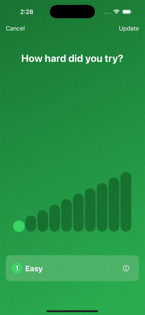
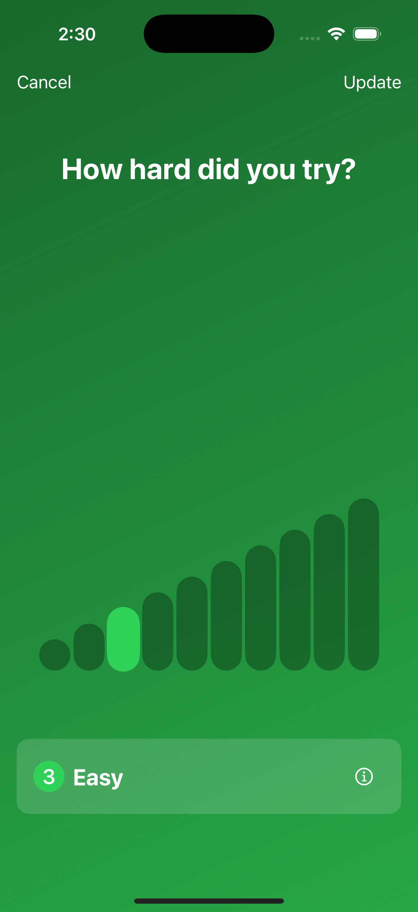
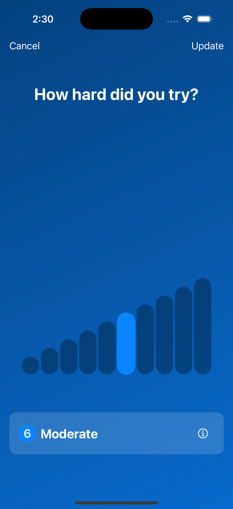
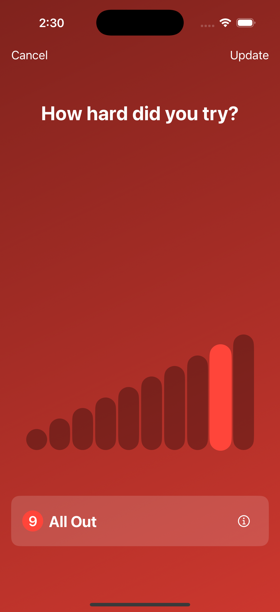

# SwiftUI Effort Rating View

A customizable SwiftUI component for collecting user effort ratings through an interactive bar-based interface. Inspired by Apple Fitness app's workout rating interface, this component provides a familiar and intuitive way for users to rate their effort levels.



## Screenshots

<div align="center">
  
  
  
</div>

## Features

- Interactive bar-based rating system
- 10 levels of effort across 4 intensity categories
- Animated transitions and selections
- Customizable title
- Responsive layout supporting both portrait and landscape orientations
- Callback support for effort selection


## Usage

```swift

struct ContentView: View {
    var body: some View {
        EffortRatingView(
            title: "Rate Your Effort",
            onEffortSelected: { intensity, level in
                print("Selected \(intensity.rawValue) at level \(level + 1)")
            },
            onSkip: {
                print("Rating skipped")
            }
        )
    }
}
```

### Customization Options

- `title`: Customize the view's header text
- `onEffortSelected`: Callback providing selected intensity and level (0-9)

## License

This project is available under the MIT license. See the LICENSE file for more info.

## Contributing

1. Fork it
2. Create your feature branch (`git checkout -b feature/my-new-feature`)
3. Commit your changes (`git commit -am 'Add some feature'`)
4. Push to the branch (`git push origin feature/my-new-feature`)
5. Create a new Pull Request